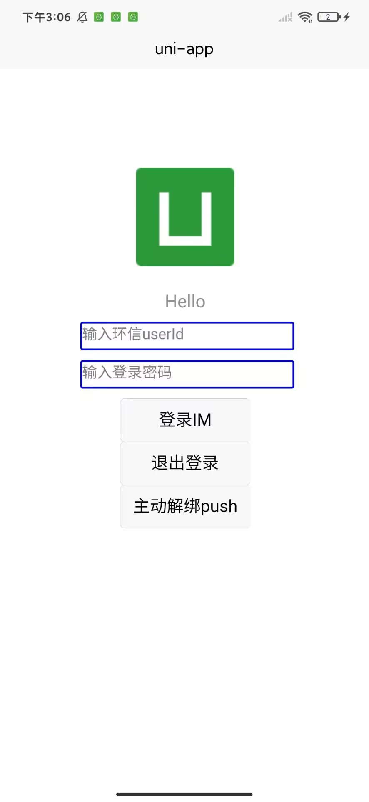
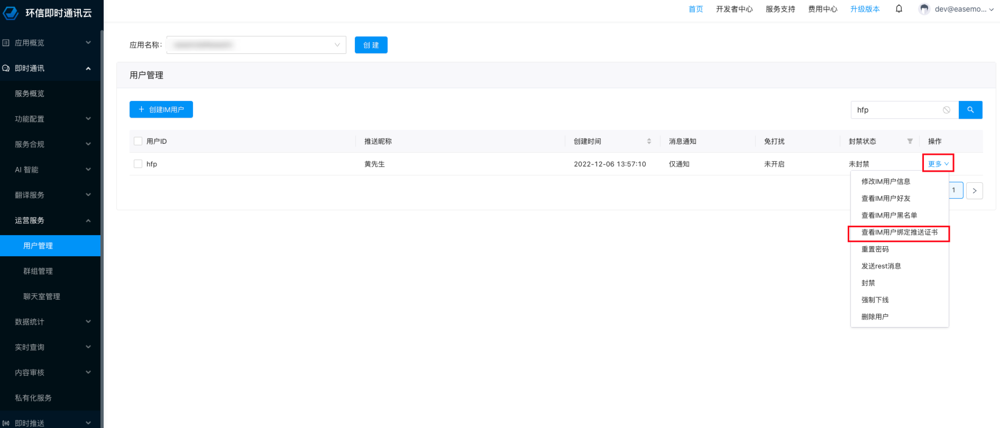
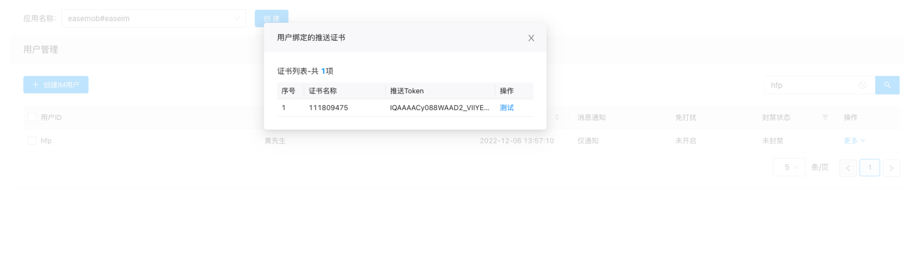
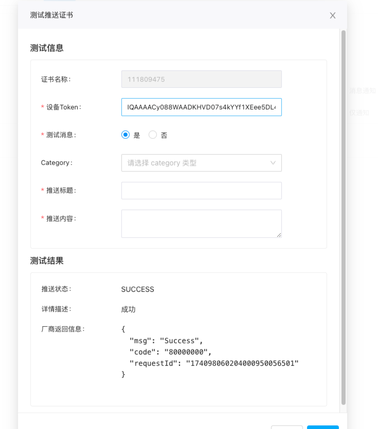

# 环信 uniApp 推送演示项目

基于 uniApp 的跨平台即时通讯消息推送解决方案，集成环信 SDK 实现多端推送功能。

## 特性亮点

- 📱 平台支持（iOS/Android）
- 🔔 原生级推送通知支持（华为/小米/vivo/oppo/荣耀/魅族/APNs）
- 💬 即时通讯与推送服务深度整合
- 🔒 离线消息保障机制
- 📦 开箱即用的推送配置模板

## 技术栈

- 前端框架：uniApp (Vue3)
- 推送服务：环信 IM SDK 4.9.1+
- 依赖插件：[原生推送插件（android/iOS）](./nativeplugins/EMPushUniPlugin/)
- 开发工具：HBuilder X

## 项目核心结构

- `nativeplugins`：原生插件目录
  - `EMPushUniPlugin`：原生推送插件
- `manifest.json`：项目配置文件
- `pages.json`：页面配置文件
- `static`：静态资源目录
- `uni_modules`：uniApp 插件目录
- `pages` ：页面目录
  - `index`：首页目录
    - `index.vue`：示例调用代码
- `utils`：工具函数目录
  - `WebIM.js`：环信 IM SDK 初始化代码
- `App.vue`：应用入口组件
- `main.js`：应用入口文件

## 快速开始

- 具体使用建议直接参考环信官方文档，本项目仅作为演示使用。

  [文档入口](https://doc.easemob.com/document/applet/push/uniapp_push.html)

  ## 效果验证

  - 以下步骤以华为平台为例

  1. 环信管理后台上传在华为平台申请的证书，[参考文档](https://doc.easemob.com/document/android/push/push_huawei.html),可查看步骤一、步骤二。
  2. 生成`agconnect-services.json`文件，放置在`nativeplugins/EMPushUniPlugin/android/assets`目录下。

  3. 配置环信 IM SDK 相关信息，主要为在`utils/WebIM.js`文件中配置`appkey`。
  4. 运行项目，在自定义基座或真机进行调试方可生效。
  5. 在运行后的页面输入，userId，userPwd，点击登录按钮,登录后 SDK 内部自动进行 token 证书上传以及推送证书绑定。
     如图所示：
     
  6. 登录环信 console 管理后台，在`即时通讯/运营服务/用户管理`一栏，搜索登录用户，并点击更多，查看绑定推送证书，如图所示：
     
  7. 如绑定成功预期会如下图所示：
      8.下一步可直接在管理后台测试推送功能，首先杀死应用，然后点击测试按钮，输入一系列参数，点击测试按钮，如图所示：
     
  8. 预期效果如下面视频所示。

  - 华为推送演示视频
    <video src="./static/demo/8357919dcd93e8fad502fba9020eb12e.mov" controls="controls" width="100%"></video>

## 核心实现以及绑定代码

```javascript
<script>
import EMClient from "@/utils/WebIM.js";
// 引入 EMPushUniPlugin 推送插件
// #ifdef APP-PLUS
const EMPushUniPlugin = uni.requireNativePlugin("EMPushUniPlugin");
// #endif
// 配置推送插件
const initPushOptions = () => {
  const pushOption = {
    // @ts-ignore
    emPush: EMPushUniPlugin,
    // 配置需要推送的证书名称
    config: {
      //👇小米推送证书名称，该段数字为伪小米推送后台生成的证书名称，请使用替换为自己的证书名称
      MICertificateName: "2882303761520334485", // 小米推送证书名称
      // OPPOCertificateName: "xxxxxx", // oppo 推送证书名称
      //👇华为推送证书名称，该段数字为伪华为推送后台生成的证书名称，请使用替换为自己的证书名称
      HMSCertificateName: "111809475", // 华为推送证书名称
      // VIVOCertificateName: "xxxxxx", // vivo 推送证书名称
      // HONORCertificateName: "xxxxxx", // 荣耀推送证书名称
      // MEIZUCertificateName: "xxxxxx", // 魅族推送证书名称
      // APNsCertificateName: "xxxxxx", // APNs推送证书名称
    },
  };
  // 调用 IM SDK 方法，注册推送插件
  EMClient.usePlugin(pushOption, "push");
};
export default {
  // 在 uniapp onLaunch 事件中初始化推送插件
  onLaunch: function () {
    // #ifdef APP-PLUS
    if (EMPushUniPlugin) {
      console.log("EMPushUniPlugin is ready");
      EMPushUniPlugin.initPushModule();
      initPushOptions();
    }

    // #endif
  },
  onShow: function () {
    console.log("App Show");
  },
  onHide: function () {
    console.log("App Hide");
  },
};
</script>
```

## 平台特定集成指南

针对不同推送平台，我们提供了详细的集成指南和关键配置截图：

- **[OPPO推送集成指南](./Doc/OPPO/OPPO推送集成指南.md)** - 详细的OPPO平台推送配置步骤
- **[OPPO关键截图说明](./Doc/OPPO/关键截图说明.md)** - OPPO推送配置的关键截图和验证步骤
- **[小米推送集成指南](./Doc/Xiaomi/小米推送集成指南.md)** - 详细的小米平台推送配置步骤
- **[小米关键截图说明](./Doc/Xiaomi/关键截图说明.md)** - 小米推送配置的关键截图和验证步骤

更多平台指南将逐步添加，请查看[Doc目录](./Doc/README.md)获取完整信息。

## 特别注意

- 【重要】华为的推送绑定配置与其他厂商配置不同，需要生成`agconnect-services.json`文件，放置在`nativeplugins/EMPushUniPlugin/android/assets`目录下。
- 【重要】由于涉及使用本地原生插件，务必在自定义基座或真机进行调试方可有效。
- 本项目仅作为演示使用，不建议直接用于生产环境。
- 如基于自己项目测试，请确保您已经注册并获取了环信 IM SDK 的 AppKey，且在环信 console 管理后台上传对应平台证书。
- 本项目仅支持 Android 和 iOS 平台，其他平台暂未支持。

```bash
# 克隆项目
git clone https://github.com/Easemob-Community/easemob-uniApp-push-demo

# 安装依赖
npm install

# 运行项目
使用 HBuilder X 打开项目，运行即可，前提必须进行必要的证书配置，以及配置环信 IM SDK 相关信息，且在自定义基座或真机进行调试方可生效。
```
